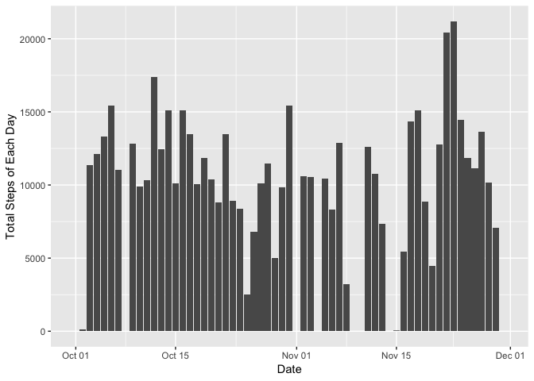

This is an Markdown Report created by Aifyer.Liu for the Reproducible Research Class week2 Peer-graded Assignment: Course Project 1 of the activity data analysis.

## Loading and preprocessing the data

1. Load the data and name as "atv".

```r
if (!file.exists("activity.csv")){unzip("activity.zip")}
atv <- read.csv("activity.csv",sep=",",stringsAsFactors = F)
```

2. Transform the data: transform the date variable from "character" to "date" format.

```r
library(lubridate)
```

```
## 
## Attaching package: 'lubridate'
```

```
## The following object is masked from 'package:base':
## 
##     date
```

```r
atv <- transform(atv,date=ymd(atv$date))
```


## What is mean total number of steps taken per day?

1. Make a histogram of the total number of steps taken each day 

```r
stepD <- with(atv,tapply(steps,date,sum,na.rm=T))
stepD <- data.frame(stepD=stepD,date=ymd(names(stepD)))
library(ggplot2)
g <- ggplot(stepD,aes(x=date,y=stepD))
g+geom_col()+labs(x="Date",y="Total Steps of Each Day")
```

<!-- -->

2. Calculate and report the **mean** and **median** total number of steps taken per day

```r
stepDmean <- as.integer(mean(stepD$stepD))
stepDmedian <- median(stepD$stepD)
```
The mean total steps taken per day is 9354, and median total steps is 10395


## What is the average daily activity pattern?

1. Make a time series plot of the 5-minute interval (x-axis) and the average number of steps taken, averaged across all days (y-axis)

```r
itMean <- with(atv,tapply(steps,interval,mean,na.rm=T))
itMeandf <- data.frame(stepMean=itMean, interval=names(itMean),stringsAsFactors = F)
g <- ggplot(itMeandf,aes(x=interval,y=stepMean,group=1))
g+geom_line()+labs(x="Interval",y="Average Steps of Each 5-minute Interval")+
      scale_x_discrete(breaks=itMeandf[seq(1,288,by=24),2],limit=0:2360)
```

<!-- -->

2. Which 5-minute interval, on average across all the days in the dataset, contains the maximum number of steps?

```r
intervalMax <- itMeandf[itMeandf$stepMean==max(itMeandf$stepMean),2]
```
The 835 interval contains the maximum numbers of steps. Which means at 8:35 in the morning, the subject takes max steps among the day.


## Imputing missing values

1. Calculate and report the total number of missing values in the dataset (i.e. the total number of rows with `NA`s)

```r
naMean <- round(mean(is.na(atv$steps)),2)
naNumber <- nrow(atv[is.na(atv$steps),])
```
The total number of missing values in the dataset is 2304, which counts of 0.13 of the total dataset.

2. Devise a strategy for filling in all of the missing values in the dataset.
The strategy I use here is the mean for that 5-minute interval.

3. Create a new dataset that is equal to the original dataset but with the missing data filled in.

```r
amerg <- merge(atv,itMeandf,by="interval",all.y=F)
amerg$steps <- ifelse(is.na(amerg$steps),as.integer(amerg$stepMean),amerg$steps)
atvf<- amerg[order(amerg$date),c(2,3,1)]
```
The new data set is named "atvf"

4. Make a histogram of the total number of steps taken each day and Calculate and report the **mean** and **median** total number of steps taken per day. Do these values differ from the estimates from the first part of the assignment? What is the impact of imputing missing data on the estimates of the total daily number of steps?

```r
stepDf <- with(atvf,tapply(steps,date,sum,na.rm=T))
sDf <- data.frame(stepDf=stepDf,date=ymd(names(stepDf)))
g <- ggplot(sDf,aes(x=date,y=stepDf))
g+geom_col()+labs(x="Date",y="Total Steps of Each Day")
```

<!-- -->

```r
stepDfmean <- as.integer(mean(sDf$stepDf))
stepDfmedian <- median(sDf$stepDf)
```
After imputing the missing values, the **mean** and **median** total number of steps taken per day differs with the first part of the assignment. Both of the values increased, especially the **mean** value, is 10749 now. And the new **median** value is 10641.


## Are there differences in activity patterns between weekdays and weekends?

1. Create a new factor variable in the dataset with two levels -- "weekday" and "weekend" indicating whether a given date is a weekday or weekend day.

```r
atvf$weekDay <- ifelse(wday(atvf$date) %in% c(1,7),"weekend","weekday")
```

2. Make a panel plot containing a time series plot of the 5-minute interval (x-axis) and the average number of steps taken, averaged across all weekday days or weekend days (y-axis). 

```r
wend <- with(subset(atvf,weekDay=="weekend"),tapply(steps, interval, mean))
wendf <- data.frame(stepMean=wend,interval=names(wend),weekDay="weekend")
wday <- with(subset(atvf,weekDay=="weekday"),tapply(steps, interval, mean))
wdayf <- data.frame(stepMean=wday,interval=names(wday),weekDay="weekday")
wMean <- rbind(wdayf,wendf)

g <- ggplot(wMean,aes(x=interval,y=stepMean,group=1))
g+geom_line()+labs(x="Interval",y="Average Steps of Each 5 min Interval")+
      scale_x_discrete(breaks=itMeandf[seq(1,288,by=24),2],limit=0:2360)+
      facet_grid(weekDay~.)
```

<!-- -->


